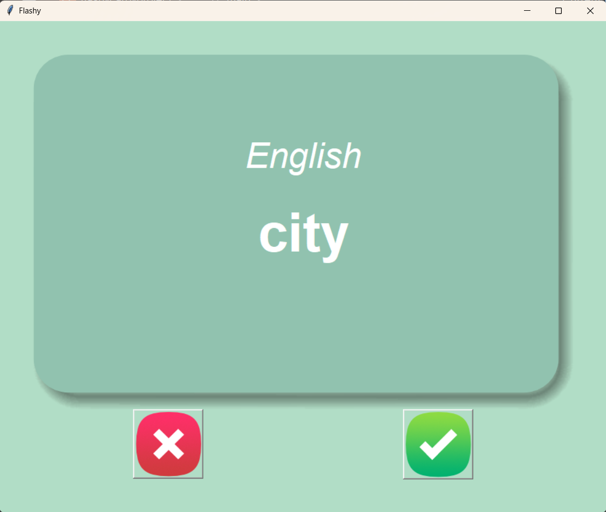

# 📚 Flash Card – French Language App 🇫🇷

A simple Python-based **flash card app** to help you learn French vocabulary through spaced repetition. Built using **Tkinter** for the GUI and **Pandas** to manage the word list.

---

## 🖼️ Preview

> 

---

## 🚀 Features

- Flip cards between **French** and **English**
- Track learned words and save progress
- Simple and intuitive GUI using `Tkinter`
- Data-driven: words stored in CSV files

---

## 📁 Project Structure

.
├── main.py # Main script with Tkinter UI logic
├── data/
│ ├── french_words.csv # Full word list (French–English)
│ └── words_to_learn.csv # Remaining words not yet learned
├── images/
│ ├── card_front.png
│ ├── card_back.png
│ ├── right.png
│ └── wrong.png
└── flashcard_preview.png # Screenshot (optional)

yaml
Copy code

---

## 🔧 Requirements

Make sure you have Python 3 installed. Then install dependencies:

```bash
pip install pandas
Tkinter is included with most Python installations.

 How to Run
Clone the repo and run the app:

bash
Copy code
git clone https://github.com/santoryuZ/Flash_Card_French_Language.git
cd Flash_Card_French_Language
python main.py

